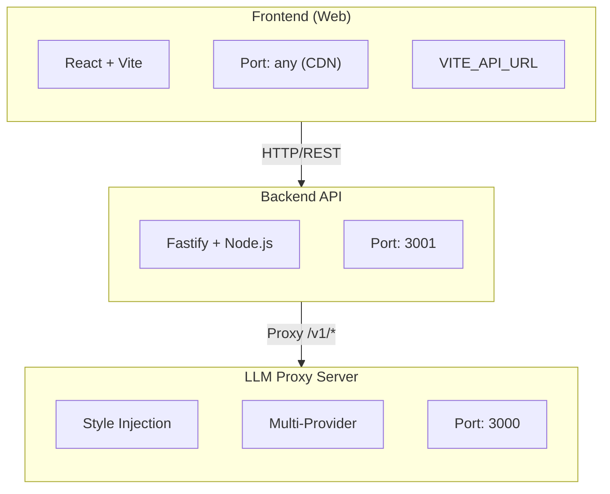

# MeSame - Your Personal Style Proxy

[](https://opensource.org/licenses/MIT)


[](https://github.com/openhoat/mesame/stargazers)
[](https://github.com/openhoat/mesame/network/members)
[](https://github.com/openhoat/mesame/issues)

> ⚠️ **Work In Progress** — This project is under active development. Features and documentation may be incomplete or subject to change.

> **"The AI that writes like me, for me."**

MeSame is a local meta-agent that analyzes your linguistic fingerprint and transforms any LLM (OpenAI, Claude, Ollama) into a faithful digital twin.

> 🤖 **This project was entirely built with AI** — from architecture to code, tests, and documentation.

📖 **[Full Documentation](https://openhoat.github.io/mesame/)**

## 💡 Why MeSame?

Every LLM has its own voice — GPT sounds like GPT, Claude sounds like Claude. But what if you want the AI to sound like **you**?

MeSame captures **your** writing style — tone, syntax, vocabulary patterns — and injects it as context into any model you use. Your documents stay local, your style travels everywhere.

**Use Cases:**
- Content creators maintaining consistent brand voice across AI-generated content
- Writers who want AI assistance that matches their personal style
- Teams enforcing consistent communication tone
- Privacy-conscious users who want local analysis without cloud exposure

## 🚀 Features

- **Local Analysis**: Documents (PDF, MD, TXT) analyzed entirely on your machine — zero cloud exposure
- **Style Profiling**: Automatic linguistic portrait (tone, syntax, language patterns, lexical richness)
- **Universal Proxy**: OpenAI-compatible API proxy — swap your endpoint URL and any app gets your style
- **Multi-Provider Support**: Works with OpenAI (GPT-4o, GPT-4), Claude (Anthropic), Google AI (Gemini), and Ollama (local models)
- **Admin Dashboard**: Import sources, visualize detected patterns, manage API keys, browse chat logs
- **Real-time Streaming**: Server-Sent Events (SSE) support for streaming responses
- **Multi-language**: Supports 10+ languages for style detection and responses
- **CDN-Ready Frontend**: Deploy the web UI to any static hosting (Vercel, Netlify, Cloudflare Pages)

## 🏗️ Architecture

### Two-Server Design



### Key Benefits

- **Separation of Concerns**: LLM proxy is stateless, API server manages database
- **Scalability**: Deploy frontend on CDN, backend on your infrastructure
- **Security**: CORS configuration, no external database required

## 🛠️ Tech Stack

| Component | Technology |
| :--- | :--- |
| **Language** | TypeScript (Fullstack) |
| **Frontend** | React + Vite + Mantine + Tailwind CSS |
| **Backend** | Node.js + Fastify (Proxy & API) |
| **AI Orchestration** | LangChain.js |
| **NLP Local** | Natural & Compromise.js |
| **Database** | SQLite + Prisma ORM |
| **Testing** | Vitest (Unit) + Playwright (E2E) |

## 📥 Quick Install

### Option A — Docker (Recommended)

```bash
# Clone the repository
git clone https://github.com/openhoat/mesame.git
cd mesame

# Start both services
docker compose up -d

# View logs
docker compose logs -f
```

**Services:**
- **LLM API**: `http://localhost:3000` — OpenAI-compatible proxy endpoint
- **Web Dashboard**: `http://localhost:3001` — Admin interface for configuring providers

### Option B — Run from Source

```bash
git clone https://github.com/openhoat/mesame.git
cd mesame
npm install
```

**Initialize database:**
```bash
npm run db:generate
npm run db:push
```

**Start the LLM API server:**
```bash
npm run llm
# or use the CLI
mesame --provider openai --model gpt-4o
```

**Start the web dashboard:**
```bash
npm run web
```

**Start both for development:**
```bash
npm run dev
```

**Prerequisites**: Node.js 22+, npm

> See the [Getting Started guide](https://openhoat.github.io/mesame/guide/getting-started) for detailed setup instructions including provider configuration.

## 💻 CLI Usage

MeSame includes a command-line interface for starting the LLM API server with custom options.

### Installation

```bash
# Install globally (recommended)
npm install -g .

# Or use npx without installation
npx mesame [options]
```

### Usage

```bash
mesame [options]
```

### Options

| Option | Alias | Description | Default |
|--------|-------|-------------|---------|
| `--port <number>` | `-p` | Port to listen on | `3000` |
| `--host <string>` | `-h` | Host to bind to | `localhost` |
| `--provider <provider>` | | LLM provider (`openai`, `anthropic`, `google`, `ollama`, `mock`) | `ollama` |
| `--model <string>` | `-m` | Model to use | `gpt-4o` (varies by provider) |
| `--target-base-url <url>` | `-u` | Target API base URL | Provider default |
| `--log-level <level>` | `-l` | Log level (`fatal`, `error`, `warn`, `info`, `debug`, `trace`, `silent`) | `info` |
| `--language <code>` | | Language code (e.g., `en`, `fr`) | Auto-detected |
| `--version` | `-V` | Display version number | |
| `--help` | | Display help information | |

### Examples

```bash
# Start with default settings (Ollama on port 3000)
mesame

# Start on custom port and host
mesame --port 8080 --host 0.0.0.0

# Use OpenAI provider with specific model
mesame --provider openai --model gpt-4o

# Use Claude with debug logging
mesame --provider anthropic --model claude-3-opus-20240229 --log-level debug

# Use custom Ollama URL
mesame --provider ollama --target-base-url http://192.168.1.100:11434

# Combine multiple options
mesame -p 8080 --provider anthropic -m claude-3-sonnet-20240229 -l info
```

### Environment Variables

CLI options override environment variables. If no CLI option is provided, MeSame reads from:

**LLM API Server:**
| Variable | Description | Default |
|----------|-------------|---------|
| `MESAME_LLM_PORT` | LLM server port | `3000` |
| `MESAME_LLM_HOST` | LLM server host | `0.0.0.0` |
| `MESAME_LOG_LEVEL` | Logging level | `info` |

**Web Dashboard:**
| Variable | Description | Default |
|----------|-------------|---------|
| `MESAME_WEB_PORT` | Web server port | `3001` |
| `MESAME_WEB_HOST` | Web server host | `0.0.0.0` |
| `MESAME_LLM_URL` | LLM server URL (for proxy) | `http://localhost:3000` |
| `CORS_ORIGIN` | Allowed CORS origins | `*` (all origins) |

**Provider Configuration (CLI only):**
| Variable | Description | Default |
|----------|-------------|---------|
| `MESAME_PROVIDER` | LLM provider | `ollama` |
| `MESAME_MODEL` | Model name | `gemma3:1b` (ollama) / `gpt-4o` (others) |
| `MESAME_TARGET_BASE_URL` | Target API URL | Provider default |

> **Note**: When using Docker, providers are configured via the web dashboard and stored in the database. The provider environment variables are only used in CLI/combined server mode.

**API Keys:**
| Variable | Description |
|----------|-------------|
| `OPENAI_API_KEY` | OpenAI API key |
| `ANTHROPIC_API_KEY` | Anthropic API key |
| `GOOGLE_API_KEY` | Google AI API key |

## 🌐 CDN Deployment

The frontend can be deployed to any static hosting service:

```bash
# Build with API URL
VITE_API_URL=https://api.mesame.com npm run build:web

# Output: dist/web/
# Deploy to Vercel, Netlify, Cloudflare Pages, etc.
```

**Backend CORS Configuration:**

```bash
# In backend environment
CORS_ORIGIN=https://app.mesame.com
```

## 📖 Documentation

- [Getting Started](https://openhoat.github.io/mesame/guide/getting-started) — Installation and provider setup
- [Usage](https://openhoat.github.io/mesame/guide/usage) — How to use the admin dashboard and configure style profiles
- [Configuration](https://openhoat.github.io/mesame/guide/configuration) — Provider settings and environment variables
- [Architecture](https://openhoat.github.io/mesame/guide/architecture) — Project structure and design overview
- [Troubleshooting](https://openhoat.github.io/mesame/guide/troubleshooting) — Common issues and solutions
- [Contributing](https://openhoat.github.io/mesame/guide/contributing) — How to contribute to the project
- [Changelog](https://github.com/openhoat/mesame/blob/main/CHANGELOG.md) — Version history and release notes

## 🔒 Security & Privacy

MeSame is designed with a local-first philosophy to protect your data.

- **Zero-Cloud Analysis**: Document parsing and style analysis run entirely on your machine.
- **Local-First**: The proxy server binds to `127.0.0.1` by default, ensuring no external network access.
- **Data Protection**: Your style profiles are stored in a local SQLite database. No telemetry or usage data is collected.
- **CORS Protection**: Configure allowed origins for production deployment.
- **API Keys**: Keys are stored locally in environment files or database.

For security vulnerabilities, please contact: openhoat@gmail.com

## 📄 License

This project is licensed under the MIT License - see the [LICENSE.txt](LICENSE.txt) file for details.

Copyright © 2026 Olivier Penhoat

## 👨‍💻 Author

Olivier Penhoat <openhoat@gmail.com>

## 🙏 Acknowledgments

- The LangChain team for their excellent AI orchestration framework
- Anthropic, OpenAI, Google, and Ollama for their LLM platforms
- The open-source community for the tools that made this possible