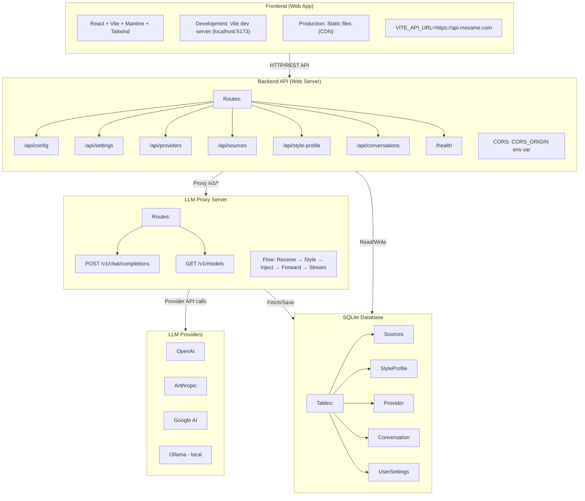
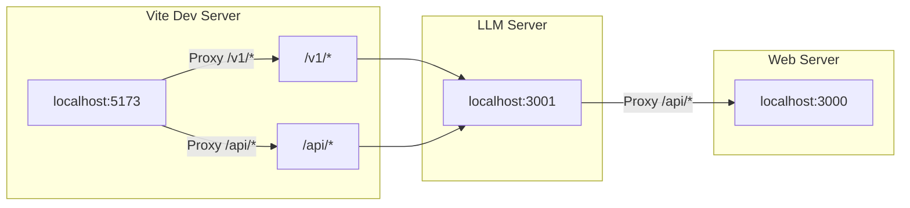
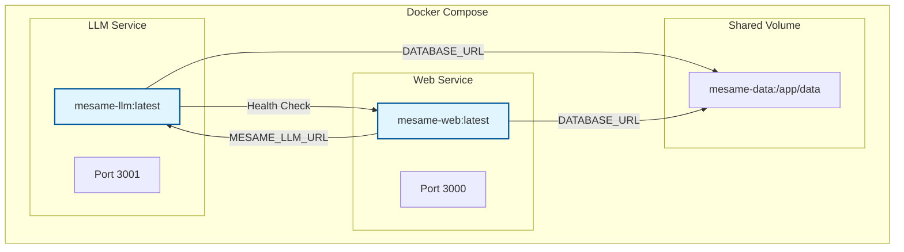
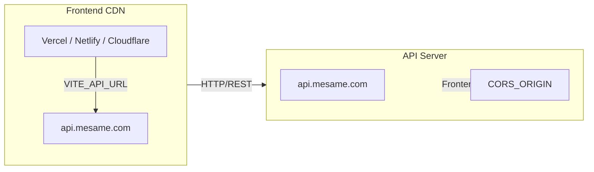
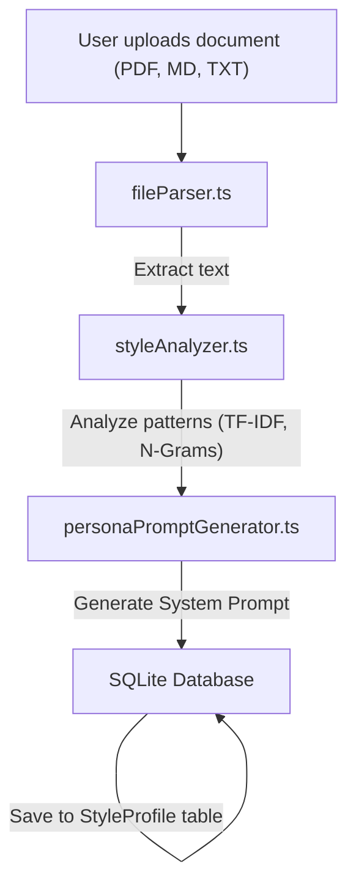
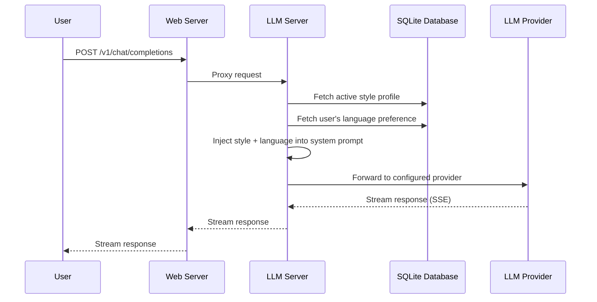

# Architecture

MeSame is built with a modern TypeScript stack, designed for local-first operation and maximum flexibility.

## System Overview



## Deployment Architecture

### Development Mode



### Production (Docker Compose)



**Configuration:**

```yaml
services:
  llm:
    image: mesame-llm:latest
    ports: ["3001:3001"]
    volumes: ["mesame-data:/app/data"]
    environment:
      - DATABASE_URL=file:/app/data/mesame.db
      - CORS_ORIGIN=https://app.mesame.com

  web:
    image: mesame-web:latest
    ports: ["3000:3000"]
    volumes: ["mesame-data:/app/data"]
    environment:
      - DATABASE_URL=file:/app/data/mesame.db
      - MESAME_LLM_URL=http://llm:3001
      - CORS_ORIGIN=https://app.mesame.com
    depends_on:
      llm: { condition: service_healthy }
```

### Production (CDN + API)



## Directory Structure

```
mesame/
├── src/                    # Backend (Node.js + Fastify)
│   ├── llm-server.ts        # LLM proxy server entry point
│   ├── web-server.ts        # Web API server entry point
│   ├── app.ts               # Combined server (CLI mode)
│   ├── config.ts            # Environment variables
│   ├── corsConfig.ts         # CORS configuration
│   ├── db.ts                 # Prisma client
│   ├── routes/               # API routes
│   │   ├── health.ts         # Health check endpoint
│   │   ├── proxy.ts          # LLM proxy endpoint
│   │   ├── sources.ts        # Source documents CRUD
│   │   ├── styleProfile.ts   # Style profile CRUD
│   │   ├── settings.ts       # User settings (language)
│   │   ├── providers.ts      # Provider management
│   │   └── ui.ts             # Static UI serving
│   └── services/             # Business logic
│       ├── fileParser.ts     # Document parsing (PDF, MD, TXT)
│       ├── styleAnalyzer.ts  # NLP analysis (TF-IDF, N-Grams)
│       ├── personaPromptGenerator.ts # System Prompt generation
│       ├── styleInjector.ts  # Inject style into LLM requests
│       ├── llmProvider.ts    # Multi-provider LLM abstraction
│       ├── languageService.ts # Language preference management
│       └── userSettingsService.ts # User settings management
├── web/                     # Frontend (React + Vite)
│   ├── src/
│   │   ├── components/      # UI components
│   │   │   ├── chat/         # Chat interface
│   │   │   └── dashboard/    # Admin dashboard
│   │   ├── config/          # API configuration
│   │   │   └── api.ts        # Centralized API URLs
│   │   ├── hooks/           # React hooks
│   │   ├── services/        # API clients
│   │   └── i18n.ts          # Internationalization
│   ├── .env.example         # Frontend environment template
│   └── README.md            # Frontend documentation
├── prisma/                  # Database
│   ├── schema.prisma        # Database schema
│   └── dev.db               # SQLite database file
├── docker-compose.yml       # Docker deployment
├── Dockerfile               # Multi-stage build
└── package.json             # Dependencies and scripts
```

## Core Components

### 1. Backend Servers

**LLM Server** (`llm-server.ts`):
- OpenAI-compatible proxy endpoint
- Style injection into LLM requests
- Streaming response handling

**Web Server** (`web-server.ts`):
- REST API for dashboard
- Provider management
- Source documents CRUD
- Conversation history
- Proxies `/v1/*` requests to LLM server

### 2. Frontend (web/)

**Tech Stack**:
- **React** — UI library
- **Vite** — Build tool
- **Mantine** — UI components
- **Tailwind CSS** — Styling
- **React Router** — Navigation
- **i18next** — Internationalization

**Key Features**:
- CDN-ready static build
- Configurable API URL via `VITE_API_URL`
- Real-time streaming chat (SSE)
- Responsive dashboard

### 3. Database Schema

```prisma
model Source {
  id        String          @id @default(uuid())
  title     String
  content   String
  createdAt DateTime        @default(now())
  profiles  ProfileSource[]
}

model StyleProfile {
  id            String          @id @default(uuid())
  name          String
  personaPrompt String
  metrics       String
  isActive      Boolean         @default(false)
  createdAt     DateTime        @default(now())
  updatedAt     DateTime        @updatedAt
  sources       ProfileSource[]
}

model Provider {
  id          Int      @id @default(autoincrement())
  type        String
  name        String   @unique
  displayName String
  baseUrl     String
  apiKey      String?
  enabled     Boolean  @default(false)
  priority    Int      @default(0)
  createdAt   DateTime @default(now())
  updatedAt   DateTime @updatedAt
}

model Conversation {
  id        String   @id @default(uuid())
  title     String
  messages  String
  createdAt DateTime @default(now())
  updatedAt DateTime @updatedAt
}

model UserSettings {
  id       Int    @id @default(1)
  language String @default("en")
}
```

## Environment Variables

### Backend (Server)

| Variable | Default | Description |
|----------|---------|-------------|
| `MESAME_LLM_PORT` | `3001` | LLM proxy server port |
| `MESAME_LLM_HOST` | `localhost` | LLM server host |
| `MESAME_WEB_PORT` | `3000` | Web API server port |
| `MESAME_WEB_HOST` | `localhost` | Web server host |
| `MESAME_LLM_URL` | `http://localhost:3001` | LLM server URL (for web server) |
| `MESAME_LOG_LEVEL` | `info` | Logging level |
| `CORS_ORIGIN` | `*` (all) | Allowed origins for CORS |
| `DATABASE_URL` | `file:./data/mesame.db` | SQLite database path |

### Frontend (Web)

| Variable | Default | Description |
|----------|---------|-------------|
| `VITE_API_URL` | (empty) | Backend API URL for CDN deployment |

**Development**: Leave `VITE_API_URL` empty — Vite proxies requests to backend.

**Production (CDN)**: Set `VITE_API_URL=https://api.mesame.com`

## Data Flow

### Style Analysis Flow



### Chat Request Flow



## Tech Choices

### Why Two Servers?

- **Separation of concerns**: LLM proxy is stateless, Web API has database
- **Scalability**: LLM server can be scaled independently
- **Security**: API keys only in LLM server, database only in web server

### Why Fastify?

- **Performance** — 20-30% faster than Express
- **Schema Validation** — Built-in JSON schema support
- **TypeScript-First** — Excellent type inference

### Why SQLite?

- **Local-First** — No external database needed
- **Zero Config** — Single file, no server
- **Prisma Support** — Type-safe queries

### Why React + Vite?

- **Fast Development** — Hot reload, fast builds
- **CDN-Ready** — Static files can be deployed anywhere
- **Modern Stack** — TypeScript, Tailwind, component libraries

## Testing

```bash
npm run test              # Unit tests
npm run test:coverage     # Unit tests with coverage
npm run test:e2e          # E2E tests (Playwright)
npm run validate          # QA + typecheck + tests
```

## Build & Deployment

### Development

```bash
npm run dev               # Start both servers with hot reload
npm run dev:llm           # Start LLM server only
npm run dev:web           # Start web server + Vite frontend
```

### Production (Docker)

```bash
docker compose up -d      # Start services
docker compose logs -f    # View logs
docker compose down       # Stop services
```

### Production (Manual)

```bash
npm run build:all        # Build backend + frontend
npm run llm              # Start LLM server (dist/server/llm-server.js)
npm run web              # Start web server (dist/server/web-server.js)
```

## Security Considerations

- **CORS Configuration** — Restrict origins in production via `CORS_ORIGIN`
- **Local-First** — Database never leaves your machine
- **API Key Isolation** — Keys stored only in LLM server
- **No Telemetry** — No usage data sent externally
